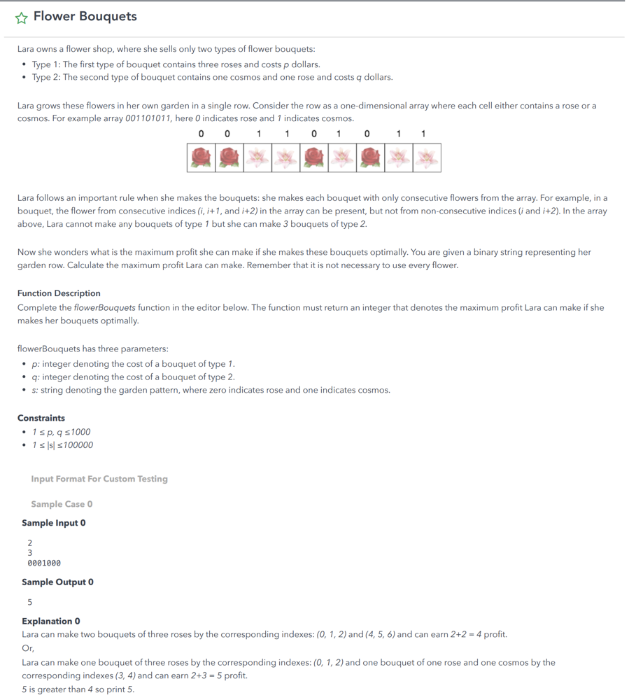

<strong>Problem:</strong> Flower Bouquets 
<strong>Category:</strong> DP (Dynamic Programming) 
<strong>Estimated Difficulty:</strong> Medium 
<strong>Language:</strong> C++

TC / SC = O(n) / O(n)

 

This is not a LeetCode problem. It's a problem I encountered at a OA of a big tech. 

Link to Flower Bouquets: [Here](https://leetcode.com/discuss/interview-question/365425/coinlist-oa-2019-nuclear-rods)\

