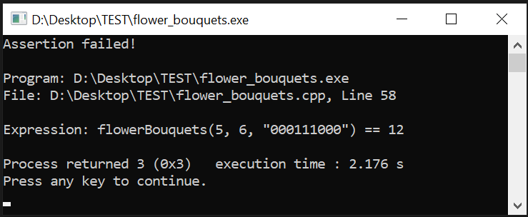

<p><strong>Problem:</strong> Flower Bouquets<br>
<strong>Category:</strong> DP (Dynamic Programming)<br>
<strong>Estimated Difficulty:</strong> Medium<br>
<strong>Language:</strong> C++</p>

TC / SC = O(n) / O(n)

<br>

This is not a LeetCode problem. It's a problem I encountered at a OA of a big tech. 

Link to Flower Bouquets: [Here](https://leetcode.com/discuss/interview-question/365425/coinlist-oa-2019-nuclear-rods)

<div class="flexible-container">
  
</div>

---

### (0) Warm-Up
Let's take 122. Best Time to Buy and Sell Stock II for example to get a bit warm up before moving forward to problem Flower Bouquets.
```cpp
class Solution {
public:
    int maxProfit(vector<int>& prices) {
        int n = prices.size();
        if (n <= 1) return 0;
        int f[2][2];
        f[0][1] = - prices[0];
        f[0][0] = 0;

        for (int i = 1; i < n; ++i) {
            f[1][1] = max(f[0][1], f[0][0] - prices[i]);
            f[1][0] = max(f[0][0], f[0][1] + prices[i]);
            f[0][1] = f[1][1];
            f[0][0] = f[1][0];
        }
        return f[1][0];
    }
};
```
---

### (1) Solution
Let's take 122. Best Time to Buy and Sell Stock II for example to get a bit warm up before moving forward to problem Flower Bouquets.

```cpp
#include <iostream>
#include <vector>
#include <string>
#include <assert.h>
using namespace std;

int flowerBouquets(int p, int q, const string& s) {
    int n = s.size();
    vector<int> dp(n + 1, 0);

    for (int i = 1; i <= n; ++i) {
        // Always take the previous state's profit
        dp[i] = max(dp[i], dp[i - 1]);

        // Check for a bouquet of three roses
        if (i >= 3 && s.substr(i - 3, 3) == "000") {
            dp[i] = max(dp[i], dp[i - 3] + p);
        }

        // Check for a mixed bouquet of a rose and a cosmos
        if (i >= 2 && (s.substr(i - 2, 2) == "01" || s.substr(i - 2, 2) == "10")) {
            dp[i] = max(dp[i], dp[i - 2] + q);
        }
    }

    // The last state will have the maximum profit
    return dp[n];
}

void testCases() {
    // Empty Garden
    assert(flowerBouquets(2, 3, "") == 0);

    // All Roses
    assert(flowerBouquets(2, 3, "000000") == 4); // Should form two type 1 bouquets

    // All Cosmos
    assert(flowerBouquets(2, 3, "111111") == 0); // Can't form any bouquet

    // Single Bouquet Type 1
    assert(flowerBouquets(10, 3, "000") == 10);

    // Single Bouquet Type 2
    assert(flowerBouquets(2, 20, "01") == 20);

    // No Profitable Bouquets
    assert(flowerBouquets(10, 20, "111") == 0); // No bouquets can be formed

    // Alternating Flowers
    assert(flowerBouquets(4, 5, "0101010101") == 25); // Five type 2 bouquets

    // Large Garden
    assert(flowerBouquets(3, 8, "000100010001000100010001") == 57); // Four type 2 bouquets

    // Multiple Bouquets
    assert(flowerBouquets(5, 6, "000111000") == 12); // Two type 1 and one type 2

    cout << "All test cases passed!" << endl;
}

int main() {
    testCases();
    return 0;
}
```

[1] Note the usage of substr()

[2] It's a standard DP problem where there're 3 cases
Case_01: dp[i] = max(dp[i], dp[i - 1])
Case_02: dp[i] = max(dp[i], dp[i - 3] + p)
Case_03: dp[i] = max(dp[i], dp[i - 2] + q)

[3] If we take out the max() function for the 3 cases above, we failed for a test case "flowerBouquets(5, 6, "000111000") == 12"

<div class="flexible-container">
  
</div>

This incorrect solution without max() function gives 11 for the test case "flowerBouquets(5, 6, "000111000")" instead of 12. Let's figure out why.

Here is the process of the correct solution:

```
// "flowerBouquets(5, 6, "000111000") == 12"

Case_01: dp[2] = dp[1] = 0
Case_02: N/A
Case_03: dp[2] = dp[2 - 2] + 0 = dp[0] + 0 = 0
Max of dp[2] = 0

Case_01: dp[3] = dp[2] = 0
Case_02: dp[3] = dp[3 - 3] + 5 = dp[0] + 5 = 5
Case_03: dp[3] = dp[3 - 2] + 0 = dp[1] + 0 = 0 
Max of dp[3] = 5

Case_01: dp[4] = dp[3] = 5
Case_02: dp[4] = dp[4 - 3] + 0 = dp[1] + 0 = 0
Case_03: dp[4] = dp[4 - 2] + 6 = dp[2] + 6 = 6
Max of dp[4] = 6

Case_01: dp[5] = dp[4] = 6
Case_02: dp[5] = dp[5 - 3] + 0 = dp[2] + 0 = 0
Case_03: dp[5] = dp[5 - 2] + 0 = dp[3] + 0 = 5 
Max of dp[5] = 6

Case_01: dp[6] = dp[5] = 6
Case_02: dp[6] = dp[6 - 3] + 0 = dp[3] + 0 = 5
Case_03: dp[6] = dp[6 - 2] + 0 = dp[4] + 0 = 6
Max of dp[6] = 6

Case_01: dp[7] = dp[6] = 6
Case_02: dp[7] = dp[7 - 3] + 0 = dp[4] + 0 = 6
Case_03: dp[7] = dp[7 - 2] + 6 = dp[5] + 6 = 12
Max of dp[7] = 12

Case_01: dp[8] = dp[7] = 12
Case_02: dp[8] = dp[8 - 3] + 0 = dp[5] + 0 = 6
Case_03: dp[8] = dp[8 - 2] + 0 = dp[6] + 0 = 6
Max of dp[8] = 12

Case_01: dp[9] = dp[8] = 12
Case_02: dp[9] = dp[9 - 3] + 5 = dp[6] + 5 = 10
Case_03: dp[9] = dp[9 - 2] + 0 = dp[7] + 0 = 12
Max of dp[9] = 12
```

Throughout the process, we see that the max() function is essetial. And the incorect solution without the max() function is doomed to fail.

---

(2) References

[1] [The description of the problem Flower Bouquets](https://leetcode.com/discuss/interview-question/365425/coinlist-oa-2019-nuclear-rods)

[2] [FlowerBouquetDP](https://github.com/NeelamVerma/FlowerBouquetDP)